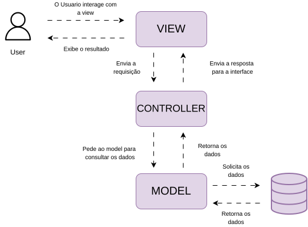

# MVC (Model-View-Controller)

**OQUE E MVC?** E um padrao de arquitetura de software que separa a aplicacao em 3 camadas, cada camada tem uma responsabilidade diferente, para uma melhor organização e manutenção do sistema

MODEL -> E responsavel pelo acesso e manipulação dos dados na aplicação nela e onde ocorre a comunicação com o banco de dados

VIEW -> E a interação com o usuario, a interface do sistema, onde o usuario visualiza e interage com a aplicacao

CONTROLLER -> É a camada de controle que faz a comunicação entre o Model e a View, e responsável por receber as requisições do usuário, processa-las, acionar o Model para acessar ou manipular os dados e enviar a resposta para a View, que a exibirá a resposta para o usuario