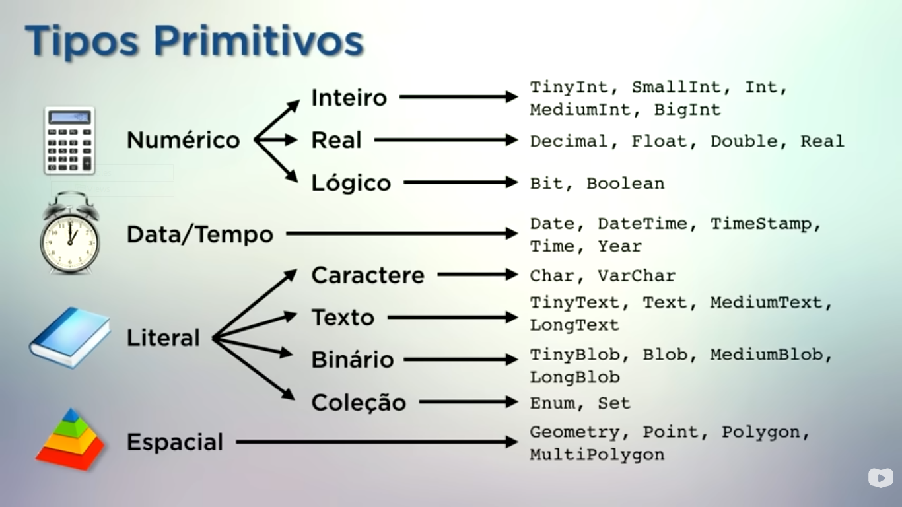

# **BANCO DE DADOS**

### Numerico

#### **inteiro ->**

        tinyint -> Guarda numeros pequenos, de -128 a 127 ou 0 a 255. Ocupa 1 byte.     
        smallint -> guarda numeros um pouco maiores, de -32.768 a 32.767 ou 0 a 65.535. Ocupa 2 bytes.
        mediumint -> usado quando os numeros sao grandes, de -8.388.608 a 8.388.607 ou 0 a 16.777.215. Ocupa 3 bytes.
        int -> guarda apenas numeros inteiros de -2.147.483.648 a 2.147.483.647 (ou de 0 a 4.294.967.295 se for UNSIGNED ). Ocupa 4 bytes.      
        bigint -> guarda numeros muito grandes, de -9.223.372.036.854.775.808 a 9.223.372.036.854.775.807 ou 0 a 18.446.744.073.709.551.615. Ocupa 8 bytes.

#### **Real ->**
    
        float -> guarda numeros reais uso recomendado para Altura, peso, temperatura e dados de sensores. 
        double -> guarda numeros reais, usado para muitas casa decimais uso recomendado para Coordenadas científicas, mapas ou cálculos complexos. 
        decimal -> guarda numeros reais uo recomendado Dinheiro, salários, preços e finanças..

#### **Logico ->**

        boolean -> guarda valores booleanos, verdadeiro ou falso. 

### Data/tempo

        date -> guarda apenas datas 
        datetime -> guarda data e hora 
        timestamp -> guarda data e hora ele preenche e atualiza sozinho, sem que você precise enviar a data e a hora novamente
        time -> guarda apenas a hora 
        year -> guarda apenas o ano 

### Literal

#### **Caractere ->**

        char -> Tamanho fixo, ou seja, sempre reserva a mesma quantidade de espaço, mesmo que o texto seja menor.
        se o dado tem o mesmo tamanho, usar char
        varchar -> tamano variável, ou seja, guarda apenas o espaço necessário para o texto
        se o dado pode ter tamanhos diferentes, usar varchar

**INTEIRO:** Valores numéricos negativo ou positivo,ou seja, valores inteiros
**REAL:** valores numéricos negativo ou positivo com casa decimal, ou seja, valores reais
**LÓGICO:** Representa valores booleanos, VERDADEIRO ou FALSO. Pode ser representado apenas um bit
**TEXTO:** sequencia de um ou mais de caracteres, colocamos os valores do tipo TEXTO

**CREATE TABLE** -> Criar a tabela.     
**ALTER TABLE** -> modificar estrutura  
**INSERT** -> adicionar novos registros a uma tabela    
**SELECT** -> é usado para recuperar dados de uma tabela em um banco de dados
**UPDATE** -> modifica registros existentes em uma tabela
**DELETE** -> usado para remover registros de uma tabela

**describe (nome da tabela)** -> usado para exibir a estrutura  nomes das colunas, tipos de dados e restrições.     
**drop database (nome do banco)** -> usado para excluir um banco de dados existente

**DEFAULT CHARACTER SET utf8mb4** -> Define o "alfabeto padrao" garante que o sistema entenda e armazene letras com acentos,e tambem caracteres de outros idiomas              
**COLLATE utf8mb4_general_ci** -> garante que o sistema compare letras com acentos e sem acentos ou maiusculas e minusculas como iguais, por exemplo, se o usuario digitar João ou joao, o sistema vai entender que é a mesma coisa e encontrar mesmo se digitado tudo maiusculo e sem acento.

##  COMANDOS CRUD                 

### Insere novos registros em uma tabela

**INSERT INTO** -> diz que você quer inserir dados na tabela    
**VALUES** -> Valores que serão inseridos

**Exemplo:**        
        **INSERT INTO** clientes (nome, cpf, email)        
        **VALUES** ('João', '12345678910', 'joao@gmail.com');

### UPDATE
Altera os dados existentes de uma linhas na tabela

update (nome da tabela)         
set (qual coluna deve ser alterada)  =  'nova alteracao'        
 where (linha que deve ser alterada) 

**ex:**     
update alunos   
set email = 'isafreiress@gmail.com'     
where id_aluno = 1

### DELETE
Remove registros de uma tabela

delete from (nome da tabela)   
where (onde deve ser deletado)  

**ex:**      
delete from alunos          
where id_aluno = 6

### CHAVE PRIMARIA (PRIMARY KEY)

A chave primária é o identificador unico de cada registro em uma tabela, por exemplo cpf, telefone, nao existe duas pessoas com o mesmo cpf ou telefone

### CHAVE ESTRANGEIRA (FOREIGN KEY)
A chave estrangeira é um campo que cria um relacionamento entre duas tabelas, ela aponta para a chave primária de outra tabela

### **RELACIONAMENTO ENTRE TABELAS**

### Diferença inner join, Left join e right join

**INNER JOIN** -> O inner join e usado para juntar duas ou mais tabelas,mostrando apenas os registros que possuem correspondência entre elas ou seja, ele so mostra os dados que existem nas duas tabelas ao mesmo  tempo, se um registro existe em uma tabela mas nao existe na outra ele nao vai aparecer no resultado da consulta     

**LEFT JOIN** -> O left join junta duas ou mais tabelas, mostrando todos os registros da tabela da esquerda e apenas os registros que possuem correspondência na tabela da direita, ou seja, ele mostra todos os registros da tabela da esquerda e apenas os registros que existem na tabela da direita, quando nao existe correspondencia, os valores da tabela da direita aparecem como NULL

**RIGHT JOIN** -> O right join junta duas ou mais tabelas, mostrando todos os registros da tabela da direita e apenas os registros que combinam na tabela da esquerda, ou seja, ele mostra todos os registros da tabela da direita e apenas os registros que existem na tabela da esquerda, quando nao existe correspondencia, os valores da tabela da esquerda aparecem como NULL          

### **COMANDO JOIN**

SELECT (colunas) 
FROM (tabela principal) 
JOIN (outra tabela)
ON (condição)

**ex:** SELECT
    a.nome_completo AS Aluno,
    p.nome AS professor
FROM turmas t
INNER JOIN alunos a
ON t.id_aluno = a.id_aluno
INNER JOIN professores p
ON t.id_professor = p.id_professor      

#### EXPLICACAO LINHA POR LINHA
SELECT -> Inicia a consulta e informa os dados que serao exibidos
a.nome_completo AS Aluno -> Mostra a coluna nome_completo da tabela alunos (a) e exibe o titulo da coluna como aluno
p.nome AS professor -> Mostra a coluna nome da tabela professores (p) e exibe titulo da coluna como professor
FROM turmas t -> Define a tabela principal como turmas 
INNER JOIN alunos a -> Junta a tabela alunos com a tabela turmas
ON t.id_aluno = a.id_aluno -> Define a condição que o id_aluno da tabela turmas deve ser igual ao id_aluno da tabela alunos
INNER JOIN professores p -> Junta a tabela professores na consulta
ON t.id_professor = p.id_professor -> Define a condição que o id_professor da tabela turmas deve ser igual da tabela professores

**RESUMINDO**
SELECT -> Oque sera mostrado
FROM -> Define a tabela principal
INNER -> junta com outra tabela
ON -> Define a condição de relacionamento entre as tabelas de como elas serao ligadas